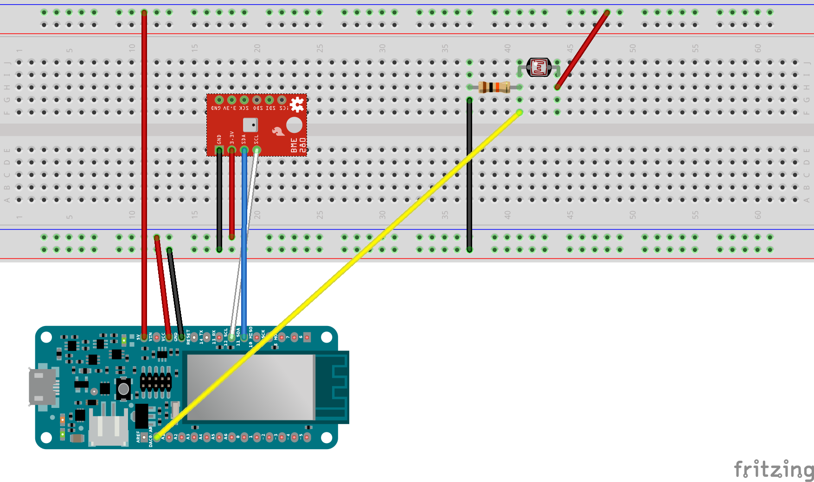

# Arduino UNO plant monitoring system

Plant monitoring system using Arduino Arduino UNO, Standard Firmata WiFi, Johnny-five.io, and Node

Based on [https://github.com/ryanjgill/mkr1000](https://github.com/ryanjgill/mkr1000)

## Guide to installing Plant Monitoring System (app)

We need to perform 3 major tasks in order to get our software up and running

1. Install and start a RethinkDB server to store our measurements.

2. Install Standard Firmata sketch on the Arduino UNO and make sure it is connected to your home network.

3. Install Node.js to run our express web sever for both johnny-five and the client UI.

### 1. Installing RethinkDB

Go to https://www.rethinkdb.com/docs/install/ and click the appropriate installation depending on your operating system.

Follow the installation instruction on the rethinkdb website.

Once the installation has finished, you can start rethinkdb from the terminal by simply typing 'rethinkdb'. If you are on windows you will need to execute the rethinkdb.exe file that was unpacked during the installation. Simply open the cmd line and change directories to the location of the rethinkdb.exe. Then type `rethinkdb.exe` to start the rethinkdb server.

Now that the rethinkdb server is running, we can open our web broswser and go to `localhost:8080`. This is the rethinkdb web interface where you can manage your cluster. Here we will need to create the database `plant_monitoring_system` and a table to store our measurements named `measurements`.

To create a database, we can use the web interface. Open the web browser and go to `localhost:8080/tables`. Then click `add Database` button to create our database for this project. Type `plant_monitoring_system` with the underscores in the name. Then click create.

Next click the `Add table` button. Then type `measurements` and click create.

We now have a RethinkDB server running with our database `plant_monitoring_system` and our table `measurements`.

### Wiring

* SCL -> A5
* SCA -> A4

